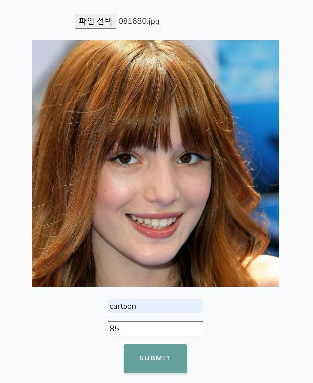

# Choco_python - Deep learning Style Transfer Service Using Flask
**Flask for Style-Transfer Prototype**

> ~~Link : http://choco-python.kro.kr:5002/~~
(상시 가동중은 아닙니다.😅)

## Updates

- [2022/05/29] Character Style Transfer and website linkage completed

## Function 
* Neural Style Transfer
  * Background Style Transfer
  * Character Style Transfer

## **Installation**

**Clone this reop:**

```shell
git clone https://github.com/del-luna/choco_python.git
cd choco_python
```

**Dependencies:**

Caution! Works only in linux environment

All dependencies for defining the environment are provided in `environment/choco_python_env.yaml`  We recommend running this repository using [Anaconda](https://docs.anaconda.com/anaconda/install/):

```shell
conda env create -f ./environment/choco_python_env.yaml
```

### Start Server
```cmd
python start_flask.py
```

<br>

## Main Page


## Style Transfer
* **Input**


* **Output**


## Reference

- https://github.com/jaehyeongAN/PyFlask_DL-service
- https://github.com/williamyang1991/DualStyleGAN

- https://github.com/zyxElsa/CAST_pytorch